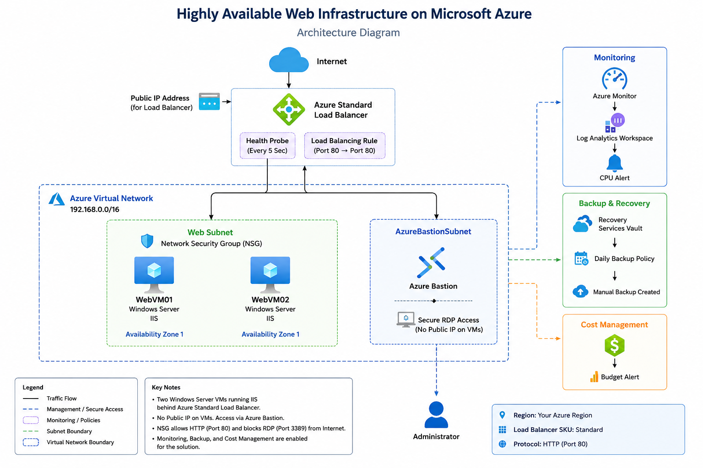

# Highly Available Web Infrastructure on Microsoft Azure

## Overview

This project demonstrates the design and deployment of a highly available, secure, and monitored web infrastructure on Microsoft Azure using core Azure Administrator (AZ-104) services.

The solution hosts two Windows Server virtual machines running Internet Information Services (IIS) behind an Azure Standard Load Balancer. Administrative access is secured through Azure Bastion, while Azure Monitor, Log Analytics Workspace, Azure Backup, and Azure Cost Management provide operational monitoring, protection, and cost governance.

---

## Project Objectives

- Deploy a highly available web infrastructure on Microsoft Azure.
- Secure virtual machines without exposing public IP addresses.
- Implement centralized monitoring and alerting.
- Protect workloads using Azure Backup.
- Monitor cloud spending using Azure Cost Management.
- Demonstrate Azure administration best practices.

---

## Solution Architecture

The following diagram illustrates the overall architecture of the deployed solution.

The architecture is designed to provide high availability, secure remote administration, centralized monitoring, workload protection, and cost visibility by leveraging core Azure infrastructure services.
---

## Azure Services Used

| Azure Service | Purpose |
|---------------|---------|
| Azure Virtual Network | Provides private networking for Azure resources. |
| Azure Subnets | Separates web and management resources. |
| Azure Network Security Group | Controls inbound and outbound traffic. |
| Azure Bastion | Provides secure RDP access without Public IPs. |
| Azure Virtual Machines | Hosts the IIS web servers. |
| Azure Load Balancer | Distributes incoming traffic across both web servers. |
| Azure Monitor | Monitors infrastructure health and performance. |
| Log Analytics Workspace | Collects monitoring logs and metrics. |
| Azure Backup | Protects virtual machines through scheduled backups. |
| Recovery Services Vault | Manages backup and recovery operations. |
| Azure Cost Management | Tracks project spending and budget alerts. |

---

## Network Design

## Virtual Network

The project uses a dedicated Azure Virtual Network with the following address space:

| Resource | Configuration |
|----------|---------------|
| Virtual Network | 192.168.0.0/16 |

## Subnets

| Subnet | Purpose |
|---------|---------|
| Web Subnet | Hosts the IIS web servers |
| AzureBastionSubnet | Hosts Azure Bastion for secure remote administration |

The Web Subnet contains two Windows Server virtual machines running IIS, while the AzureBastionSubnet provides secure administrative access without exposing the virtual machines to the Internet.

---

## Security Design

Security was implemented following Azure best practices.

Implemented security controls include:

- Removed Public IP addresses from both virtual machines.
- Secure Remote Desktop (RDP) access through Azure Bastion.
- Network Security Group (NSG) associated with the Web Subnet.
- HTTP traffic is allowed for the hosted web application.
- Direct RDP access from the Internet is blocked.

This design minimizes the attack surface while maintaining secure administrative access.

---

## High Availability

High availability was achieved by deploying two Windows Server virtual machines running IIS behind an Azure Standard Load Balancer. Incoming HTTP traffic is automatically distributed between both servers using a health probe and load balancing rule.

---

## Monitoring & Alerting

Azure Monitor and Log Analytics Workspace were configured to collect performance metrics and logs. CPU utilization alerts were created to notify administrators when resource usage exceeds the defined threshold.

---

## Backup Strategy

Azure Backup was configured using a Recovery Services Vault with a daily backup policy. Manual backup was also performed to verify backup functionality and recovery readiness.

---

## Cost Management

Azure Cost Management was configured with a budget and cost alert to monitor project spending and help prevent unexpected charges.

---

## Skills Demonstrated

- Azure Virtual Network (VNet)
- Azure Subnets
- Network Security Groups (NSG)
- Azure Bastion
- Azure Virtual Machines
- Azure Standard Load Balancer
- Azure Monitor
- Log Analytics Workspace
- Azure Backup
- Recovery Services Vault
- Azure Cost Management
- Windows Server Administration
- IIS Web Server

---

## Screenshots

Project screenshots will be added below.

- Architecture Diagram
- Virtual Network
- Azure Bastion
- Load Balancer
- Backend Pool
- Health Probe
- Load Balancing Rule
- IIS Website (VM1)
- IIS Website (VM2)
- Azure Monitor
- CPU Alert
- Recovery Services Vault
- Backup Policy
- Manual Backup
- Cost Budget Alert
